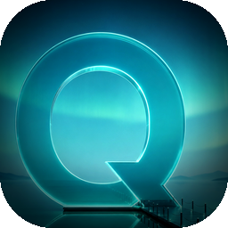

<div align="center">



# Quay

**多项目开发命令的「码头」——把散落各处的 dev 进程，统一停靠、统一监控。**

*A command center for your dev processes. Dock every project's commands in one place.*

macOS · Apple Silicon · Tauri 2 + React + Rust

</div>

---

## 这是什么

Quay 是一款 macOS 桌面应用。它把你**多个项目里、各式各样的开发命令**（`dev` server、`build`、`test`、`lint`、`electron`、自定义脚本……）集中到一个窗口里：绑定项目目录 → 自动扫描 `package.json` 的 scripts → 一键运行 → 在一块面板里实时看到**所有在跑进程的输出与内存占用**，并能在它们之间秒切。

> 名字取自 **Quay（码头 / 港湾）**——船只停靠的地方。你的每一个 dev 进程，都在这里靠岸。

---

## 产品初衷 · 它要解决什么问题

做开发的人，桌面上往往是这样的：

- 同时开着 **3、5 个项目**，每个项目又有 dev server、构建、测试、lint、桌面壳……一堆要长期跑的命令；
- 于是开出**十几个终端标签 / 窗口**，过一会儿就忘了哪个在跑什么、哪个挂了、日志在哪个 tab；
- 某个 Node 进程内存悄悄涨到几个 G，你毫无察觉，直到风扇起飞、电脑卡死；
- 每天重复敲一样的 `pnpm dev` / `npm run build`，在不同目录间 `cd` 来 `cd` 去；
- 想看某个仓库的 git 状态、想用 VSCode 打开它，又得切到别的工具。

**Quay 想消灭的，就是这种「终端混乱税」。** 核心理念只有一句：

> **绑定一次项目，之后所有命令的「启动 / 监控 / 切换 / 收尾」都在一个地方完成。**

- 不用再记命令、不用再 `cd`：项目的 scripts 自动列出来，点一下就跑。
- 不用再数终端窗口：所有在跑进程汇总在底部一条 bar，每条带**实时内存**（按进程组整棵树统计），点一下跳到它的终端。
- 不用再担心「僵尸进程」：关窗口 = 隐藏到托盘、子进程继续活；重启 App 能认领回此前跑着的进程，孤儿进程也会被侦测清理。
- 不用再切工具：每个目录一行 git 状态（分支 / 领先落后 / 脏文件数），一键用你选的编辑器（VS Code / Cursor / Zed…）打开、一键开一个该目录的终端（内置或外部终端 app）。

一句话——**Quay 是你本地开发进程的「控制塔 + 码头」**，让「同时推进多个项目」这件事，从一团乱麻变成一目了然。

---

## 核心功能

### 📦 项目 · 目录 · 命令
- **绑定项目目录**（含 `package.json`）：自动扫描 npm scripts，按用途启发式分组（开发 / 测试 / 构建…）。
- **透传脚本展开**：`"tauri": "tauri"` 这类需要子命令才有意义的脚本，自动展开为 `tauri dev` / `tauri build`（同样覆盖 expo / cap）。
- **AI 智能分组**（可选，接 DeepSeek）：让模型按语义把脚本重新归类，更贴合你的心智模型。
- **手动命令**：任意 `cwd` + 任意命令，不止于 npm scripts。
- **`package.json` 实时监听**：脚本增删改，侧栏自动重扫，无需手动刷新。

### 🖥️ 终端工作区
- **只读监控终端**：一键运行命令，PTY 真色彩输出，WebGL 加速渲染，5000 行 scrollback。
- **可输入交互终端**：在任意绑定目录开一个真·交互 shell（`zsh -li`），能打字、跑 `vim` / `htop`、`Ctrl+C` 中断，随分屏宽度自适应。
- **1 / 2 / 4 分屏**：多个终端同屏并排；所有终端常驻挂载，切页 / 切项目**不丢任何输出**。
- **常驻自绘滚动条** + 一键复制最近 100 / 300 / 全部行。
- **内置 / 外置终端可选**：默认在 App 内开交互终端；也可切到外部终端 app（Terminal / Ghostty / cmux / iTerm2 / Warp），直接在该目录开会话。

### 📊 进程监控
- 底部 **Running Bar**：全局总内存 + 每条在跑命令的进程树 RSS，实时轮询。
- **端口可见**：每条命令正在监听的端口直接显示在运行条上（lsof 实测）。
- **同端口冲突提醒**：不同项目声明同一 dev 端口时目录头亮警告徽标；启动 `tauri dev` 前实测端口占用，占用则弹确认，避免 Tauri 窗口加载到错的项目。
- 溢出折叠为 `+N`，点开看全部、点任一项跳转到对应终端。

### 🌿 Git 一览
- 每个目录一行 git 状态：当前分支、领先 / 落后、脏文件数。
- Git 面板：分支拓扑图 + 提交历史（默认 `--all` 展示真实的分叉 / 合并）。

### ⚙️ 个性化
- **默认编辑器可选**：VS Code / Cursor / Windsurf / Zed / Sublime Text / Xcode —— 设置里挑一个，侧栏「打开编辑器」按钮的图标随之变成对应品牌字形；自动扫描本机已装哪些（未装置灰）。
- **默认终端可选**：内置交互终端，或外部终端 app（Terminal / Ghostty / cmux / iTerm2 / Warp）。
- **主题信号色**：内置配色预设 + 自定义五个语义信号色（强调 / AI / 运行 / 警告 / 错误）。
- **字体 / 渲染**：终端与界面字体分别可调；GPU（WebGL）渲染开关。

### 🍎 原生体验
- 菜单栏托盘（关窗口隐藏到托盘，进程不中断）、单实例、原生标题栏拖拽、强制深色外观、命令跑完系统通知。
- **已签名 + 公证**：Developer ID 签名 + Apple 公证，下载即用，不触发 Gatekeeper 拦截。

---

## 安装

前往 [Releases](https://github.com/Zhanglala103838/quay/releases) 下载对应平台的安装包：

| 平台 | 文件 | 说明 |
|------|------|------|
| **macOS** (Apple Silicon) | `Quay_x.y.z_aarch64.dmg` | 已经过 Apple 公证，打开拖进「应用程序」即可，无需任何「允许未知开发者」操作 |
| **Windows** (x64) | `Quay_x.y.z_x64-setup.exe` | 实验性 · **未代码签名**，首次运行 SmartScreen 提示时点「更多信息 → 仍要运行」 |

> Windows 版为新移植（Tauri 跨平台），核心的多命令并行 / 实时内存 / 端口可见均已具备；"用编辑器/终端打开目录"暂未支持（依赖 macOS 机制）。

---

## 从源码构建

**前置依赖**：[Rust](https://rustup.rs/) · [Node.js](https://nodejs.org/) ≥ 18 · [pnpm](https://pnpm.io/) · Xcode Command Line Tools

```bash
pnpm install

# 开发（热更新）
pnpm tauri dev

# 本地构建（未签名 .app / .dmg）
pnpm tauri build
```

**签名 + 公证打包**（需自己的 Apple Developer ID 与 API Key）：

```bash
bash scripts/build-mac.sh
```

> 脚本会签名 `.app`、公证、staple，并把 `.dmg` 单独提交 Apple 公证后做三层校验。凭据通过环境变量传入，详见脚本头部注释。

**Windows 构建**：无需本地 Windows 机器，由 GitHub Actions 在 `windows-latest` 上打包（见 `.github/workflows/release-windows.yml`）。手动触发产出 NSIS + MSI artifact；打 `v*` tag 时自动附加到对应 Release。

---

## 技术栈

| 层 | 选型 |
|----|------|
| 桌面壳 | **Tauri 2**（Rust） |
| 前端 | **React 19** + TypeScript + Vite + Zustand |
| 终端 | **xterm.js 6** + WebGL addon |
| 伪终端 | **portable-pty**（Rust，真 PTY，独立进程组） |
| 目录监听 | notify-debouncer-full |
| AI 分组 | DeepSeek（可选） |

---

## 状态

Quay 仍在活跃开发中，功能与界面可能变动。欢迎 issue 反馈。

## 致谢

Quay 在开发过程中大量借助 **[Claude Code](https://claude.com/claude-code)** 完成架构设计、实现与调试——从交互终端的 PTY 管线到原生 macOS 集成，感谢它的陪伴。🙏

---

<div align="center">

# Quay — English

**A "quay" for your dev commands across multiple projects — dock, run, and monitor every process in one place.**

</div>

## What is it

Quay is a macOS desktop app that gathers **all the dev commands across your many projects** (`dev` servers, `build`, `test`, `lint`, `electron`, custom scripts…) into a single window: bind a project directory → it auto-scans the `package.json` scripts → one click to run → watch **every running process's live output and memory** in one panel, and jump between them instantly.

> Named after a **quay** — the dock where ships come to rest. Every one of your dev processes berths here.

## Why · the problem it solves

A developer's desktop usually looks like this: 3–5 projects open at once, each with a handful of long-running commands, spread across **a dozen terminal tabs**. You lose track of what's running, a Node process quietly balloons to several GB until your fan screams, and you keep re-typing `pnpm dev` while `cd`-ing between folders.

**Quay kills that "terminal-chaos tax."** The core idea, in one line:

> **Bind a project once; from then on, launching / monitoring / switching / cleaning up every command happens in one place.**

- No more remembering commands or `cd`-ing — a project's scripts are listed for you, one click runs them.
- No more counting terminal windows — every running process is summarized in one bottom bar, each with **live memory** (whole process-group RSS); click to jump to its terminal.
- No more zombie processes — closing the window hides to tray and keeps children alive; relaunching re-adopts still-running processes, and orphans get reconciled.
- No more tool-switching — per-directory git status at a glance, one-click "open in your editor" (VS Code / Cursor / Zed…), one-click terminal for any directory (built-in or an external terminal app).

## Key features

- **Projects · directories · commands** — bind dirs with `package.json`, auto-scan scripts, heuristic grouping, optional **AI grouping** (DeepSeek), arbitrary manual commands, live `package.json` watching. Passthrough scripts like `"tauri": "tauri"` expand into `tauri dev` / `tauri build` (also expo / cap).
- **Terminal workspace** — read-only monitored terminals (WebGL-accelerated PTY, 5000-line scrollback) **and** fully interactive shells (`zsh -li`: type, run `vim` / `htop`, `Ctrl+C`); 1 / 2 / 4 split layouts; all terminals stay mounted (no lost output on switch); copy last 100 / 300 / all lines.
- **Process monitoring** — a Running Bar with global + per-process memory and the **ports each command is listening on**, `+N` overflow popover, click-to-jump. **Same-port conflict warnings**: flags when two projects declare the same dev port, and probes the port before launching `tauri dev` so a window never loads the wrong project.
- **Git at a glance** — per-directory branch / ahead-behind / dirty status, plus a branch-graph + commit-history panel.
- **Personalization** — pick your default editor (VS Code / Cursor / Windsurf / Zed / Sublime Text / Xcode; the sidebar button's icon follows your choice, installed apps auto-detected), default terminal (built-in or Terminal / Ghostty / cmux / iTerm2 / Warp), theme signal colors, and terminal/UI fonts.
- **Native feel** — menubar tray (hide on close, keep running), single instance, native titlebar drag, forced dark appearance, completion notifications. **Signed + notarized** — no Gatekeeper friction.

## Install

Grab the latest build for your platform from [Releases](https://github.com/Zhanglala103838/quay/releases):

| Platform | File | Notes |
|----------|------|-------|
| **macOS** (Apple Silicon) | `Quay_x.y.z_aarch64.dmg` | Apple-notarized — just drag into Applications, no Gatekeeper friction |
| **Windows** (x64) | `Quay_x.y.z_x64-setup.exe` | Experimental · **not code-signed** — on first run click "More info → Run anyway" past SmartScreen |

> Windows is a fresh Tauri cross-platform port: parallel commands, live per-process memory, and port visibility all work; "open dir in editor/terminal" is not yet supported there (relies on a macOS mechanism).

## Build from source

Requires [Rust](https://rustup.rs/), [Node.js](https://nodejs.org/) ≥ 18, [pnpm](https://pnpm.io/), and Xcode CLT.

```bash
pnpm install
pnpm tauri dev      # dev with HMR
pnpm tauri build    # local unsigned build
bash scripts/build-mac.sh   # signed + notarized (needs your Apple Developer ID)
```

## Tech stack

**Tauri 2** (Rust) · **React 19** + TypeScript + Vite + Zustand · **xterm.js 6** + WebGL · **portable-pty** (real PTY, isolated process groups) · notify-debouncer-full · DeepSeek (optional).

## Acknowledgments

Quay was built with heavy help from **[Claude Code](https://claude.com/claude-code)** — from the interactive-terminal PTY pipeline to the native macOS integration. Thank you. 🙏

---

<div align="center">
<sub>Built with Tauri · Made for developers who run too many things at once.</sub>
</div>
